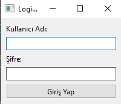
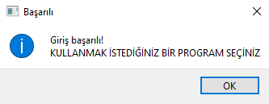
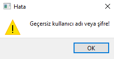
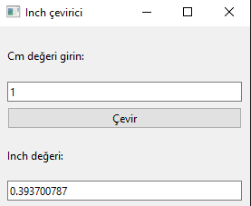
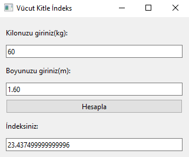
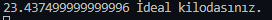

# vektorel_proje3
<h1>Masaüstü uygulamama hoş geldiniz!</h1>

<h3> > Uygulamayı açtığınızda ilk giriş ekranı gelecektir.(admin / admin ile giriş yapabilirsiniz.)</h3>

<h3> > Giriş yaptığınızda, başarılı giriş yaptığınıza dair bir pencere gelecektir.<h3>

<h3> > Eğer giriş yaparken hata yaparsanız karşınıza bu gelir. Ama korkmayın tekrardan deneyebilirsiniz❗<h3>

<h3> > Başarılı giriş yaptıktan sonra karşınıza seçme ekranı gelecektir. Kullanmak istediğiniz uygulamayı seçebilirsiniz.<h3>

<h3> > Inch Çevirici butonuna basarsanız sizi böyle bir ekran karşılayacaktır. Burda istediğiniz gibi çeviri yapabilirsiniz.😊 <h3>

<h3> > Eğer vücut kitle indeksinizi hesaplamak isterseniz alttaki butona basınız. Bastığınızda karşınıza bu ekran gelecektir. ❗Hatırlatma❗ Boyunuzu METRE olarak yazmayı unutmayınız❕<h3>

<h4> > Hesapladığınızda size böyle bir bildiri gelir. Böylelikle ideal kilo olup olmadığınızı görebilirsiniz.<h4>

